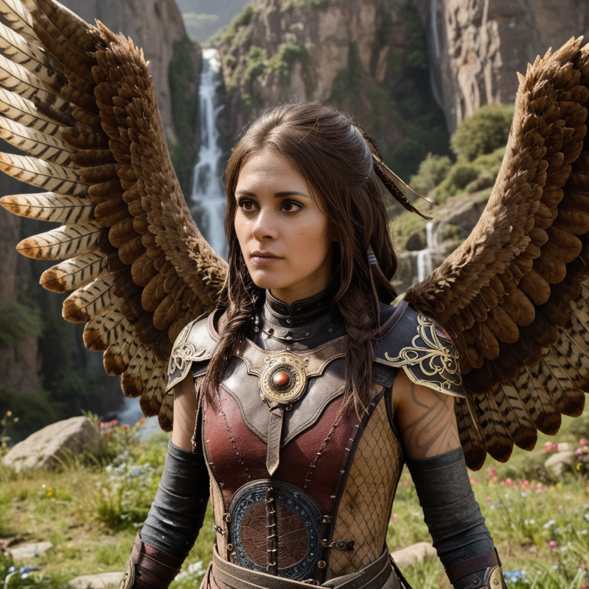
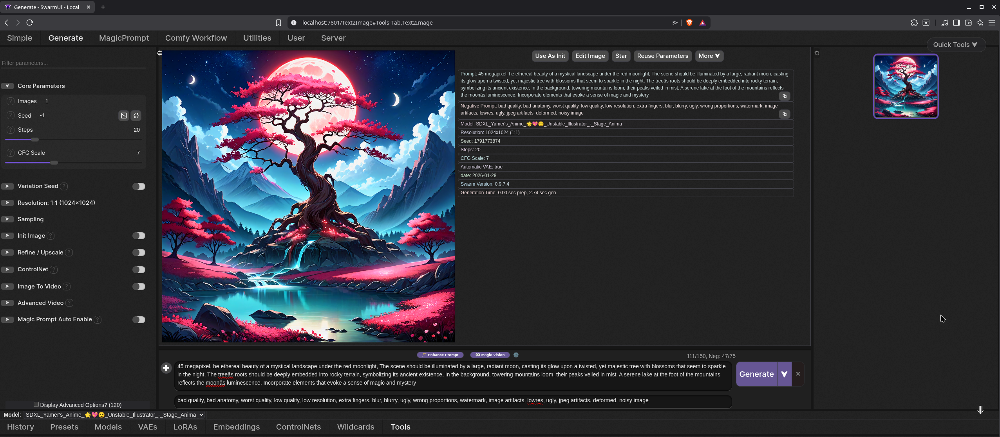

# Freya - Stable Diffusion with UI on Kubernetes



A Kubernetes-ready platform for running ComfyUI and SwarmUI Stable Diffusion interfaces with discrete GPU support. Both UIs are built from source using custom Docker images.

## Features

- 🎨 **ComfyUI**: Advanced node-based workflow interface for Stable Diffusion (built from source)
- 🐝 **SwarmUI**: Modular AI image and video generation web interface (built from source)
- 💬 **Ollama**: Local LLM API; use inside SwarmUI via the [MagicPrompt extension](https://github.com/HartsyAI/SwarmUI-MagicPromptExtension) for prompt generation and enhancement
- 🐳 **Docker Support**: Custom-built containers with GPU support for local development
- ☸️ **Kubernetes Ready**: Designed to run in Kubernetes clusters
- 🚀 **GPU Accelerated**: Full CUDA support for discrete GPUs
- 🔧 **Custom Builds**: All images built from source, not using public images

## Quick Start

### Prerequisites

- Linux (Ubuntu 22.04+ recommended)
- Docker & Docker Compose v2.0+
- NVIDIA GPU with 8GB+ VRAM (16GB+ recommended)
- NVIDIA Container Toolkit installed

See [Installation Guide](docs/installation.md) for detailed setup instructions.

### Getting Started

```bash
# Setup directories
make setup

# Optional: Quick setup = dirs + ComfyUI starter models (SDXL + VAE); add more via make download-model
make quick-setup

# Build images
make build

# Start services
make up
```

### Access the Interfaces

- **ComfyUI**: http://localhost:8188
- **SwarmUI**: http://localhost:7801
- **Ollama API**: http://localhost:11434 (use from SwarmUI via MagicPrompt extension)

### Example: SwarmUI with a sample prompt and model



Try this in **SwarmUI** (http://localhost:7801) after downloading the model:

**Model:** [SDXL Yamer's Anime Unstable Illustrator](https://civitai.com/models/76489/sdxl-yamers-anime-unstable-illustrator?modelVersionId=377674) (Civitai — checkpoint, ~6.46 GB SafeTensors). Place the file in `swarmui/data/Models/` or use SwarmUI’s built-in downloader.

**Positive prompt:**
```
45 megapixel, the ethereal beauty of a mystical landscape under the red moonlight, The scene should be illuminated by a large, radiant moon, casting its glow upon a twisted, yet majestic tree with blossoms that seem to sparkle in the night, The tree's roots should be deeply embedded into rocky terrain, symbolizing its ancient existence, In the background, towering mountains loom, their peaks veiled in mist, A serene lake at the foot of the mountains reflects the moon's luminescence, Incorporate elements that evoke a sense of magic and mystery
```

**Negative prompt:**
```
bad quality, bad anatomy, worst quality, low quality, low resolution, extra fingers, blur, blurry, ugly, wrong proportions, watermark, image artifacts, lowres, ugly, jpeg artifacts, deformed, noisy image
```

**Suggested settings (from model page):** Resolution 1024×1024 (or 576×1024, 768×1024), Steps 20–50, CFG 5–20.

## Makefile Commands

```bash
make help              # Show all available commands
make build             # Build all Docker images
make up                # Start all services
make down              # Stop all services
make sui               # SwarmUI + Ollama only (stops others first)
make cui               # ComfyUI only (stops others first)
make llm               # Ollama only (stops others first)
make swarmui-rebuild   # Recompile SwarmUI/extensions; then make down && make sui
make logs              # View logs from all services
make restart           # Restart services
make status            # Show service status and URLs
make check-gpu-comfyui # Verify GPU access in ComfyUI
make check-gpu-swarmui # Verify GPU access in SwarmUI
make llm-pull MODEL=dolphin3  # Pull default Ollama model (MagicPrompt); see https://ollama.com/library/dolphin3
make llm-list          # List installed models + browse link
make llm-rm MODEL=dolphin3  # Remove an Ollama model
make llm-logs          # View Ollama logs
```

See [Architecture Guide](docs/architecture.md) for complete command reference.

## Documentation

- [Installation Guide](docs/installation.md) - System requirements and setup
- [GPU Compatibility](docs/gpu-compatibility.md) - Compatible GPU cards
- [Kubernetes Deployment](docs/kubernetes.md) - Deploy to Kubernetes
- [Model Management](docs/MODELS.md) - Download and manage models
- [SwarmUI Video Guide](docs/swarmui-video-guide.md) - Beginner’s guide to T2V/I2V with SwarmUI (links to [HF guide](https://huggingface.co/blog/MonsterMMORPG/beginners-guide-generate-videos-with-swarmui))
- [Architecture](docs/architecture.md) - Project structure and services
- [SwarmUI MagicPrompt](docs/swarmui-magicprompt.md) - Use Ollama inside SwarmUI for prompt generation (MagicPrompt extension)
- [Troubleshooting](docs/troubleshooting.md) - Common issues and solutions

## Requirements

- **OS**: Linux (Ubuntu 22.04+ recommended)
- **GPU**: NVIDIA GPU with CUDA 12.4+ or 13.x (images use 13.1.1)
- **VRAM**: Minimum 8GB (16GB+ recommended for both services)
- **RAM**: Minimum 16GB system RAM
- **Storage**: Minimum 50GB free space

See [Installation Guide](docs/installation.md) for detailed requirements.

## Notes

- Models are downloaded on first use and cached in mounted volumes
- Generated images are saved to respective `output/` directories
- First build may take 15-30 minutes
- Both services can run simultaneously with 16GB+ GPU memory

## Acknowledgments

This project was built with [Cursor](https://cursor.sh) using the Composer model.

## License

MIT
